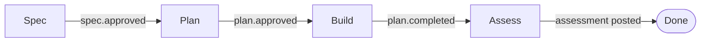

# agent-dev-flow: operator guide

The end-to-end loop lives entirely inside kbbl. A `kbbl-start` server hosts
the task tracker, the review primitive, the orchestrator state machine, and the
PWA review surfaces. Work is organized as **Epics** — each Epic carries one spec
through four stages (Spec → Plan → Build → Assess). Dispatched stages
(spec_analyzer, plan_writer, brief_writer, build) run as kbbl agent sessions spawned via
the existing `SessionManager` + Claude Code adapter; their prompts are templated
from `kbbl/prompts/{spec_analyzer,plan_writer,brief_writer,build}.md`.

## Prerequisites

- kbbl running (e.g. `./kbbl/scripts/kbbl-start /path/to/your/repo --host=0.0.0.0`).
  Confirm with `curl -sI http://<host>:8788/ | head -1`.
- `ANTHROPIC_API_KEY` exported in the kbbl process environment — spawned CC
  subprocesses inherit it.
- Optional: `KBBL_PROMPTS_DIR` to override the prompt-template directory
  (defaults to `<kbbl-root>/prompts`).
- The repo you're dispatching against is on a branch you're willing to let the
  build agent commit and push from.

## The flow



## Spec stage

Creating a spec (via the PWA or `POST /specs`) simultaneously creates an Epic.
The Epic starts in stage `spec`; `spec.created` fires and dispatches spec_analyzer.
The spec's `internal_status` advances through four sub-states:

### 1. Analyzing

**`internal_status: analyzing`** — set automatically on creation.

The spec_analyzer reads the codebase, compares it against the spec notes, and POSTs each
mismatch as a discrepancy:

```bash
curl -sX POST "$KBBL/spec-discrepancies" -H 'content-type: application/json' \
  -d '{"spec_id":"<spec_id>","spec_assumption":"<what spec says>","code_reality":"<what code shows>"}'
```

When analysis is complete (zero or more discrepancies posted), spec_analyzer advances
the spec and stops:

```bash
curl -sX PATCH "$KBBL/specs/<spec_id>/internal-status" -H 'content-type: application/json' \
  -d '{"internal_status":"discrepancies"}'
```

This emits `spec.analysis_complete`.

### 2. Discrepancies

**`internal_status: discrepancies`** — operator-resolution phase.

Each open discrepancy must be resolved or waived before the spec can advance.
The DiscrepanciesEditor panel in the Epic detail view (`#epic/<id>`) lists all
entries. To resolve or waive via the API:

```bash
curl -sX PATCH "$KBBL/spec-discrepancies/<discrepancy_id>" -H 'content-type: application/json' \
  -d '{"resolution":"<text>","status":"resolved"}'  # or "waived"
```

### 3. Review

**`internal_status: review`** — all discrepancies closed, awaiting operator sign-off.

Gated on `countOpen == 0`. The **Move to review** button in the DiscrepanciesEditor
becomes active when no open discrepancies remain:

```bash
curl -sX PATCH "$KBBL/specs/<spec_id>/internal-status" -H 'content-type: application/json' \
  -d '{"internal_status":"review"}'
# → 409 if any open discrepancies remain
```

### 4. Approved

**`internal_status: approved`** — spec frozen; plan_writer dispatches.

Operator approves in the DiscrepanciesEditor or via API:

```bash
curl -sX PATCH "$KBBL/specs/<spec_id>/internal-status" -H 'content-type: application/json' \
  -d '{"internal_status":"approved"}'
```

On approval kbbl atomically copies `notes → final_notes` (the frozen spec text
plan_writer will read), emits `spec.approved`, advances the Epic stage from `spec`
to `plan`, and dispatches plan_writer.

## 1. Bootstrap a project + spec

Open the PWA inbox and use the **Projects** sidebar on the left:

- **+ Project** in the sidebar header — opens a modal for the project
  name and an absolute `repo_path`. Creates the project; no dispatch
  fires yet.
- Expand the project, then click **+** next to **Plans / Epics** — opens
  a modal for the spec title and notes (the spec prose). Submitting this
  creates the Epic and fires `spec.created`.

For scripting or remote setup the same endpoints work directly:

```bash
KBBL=http://<host>:8788

curl -sX POST "$KBBL/projects" -H 'content-type: application/json' \
  -d '{"name":"my-project","repo_path":"/abs/path/to/repo"}'
# → { "id":"<project_id>", ... }

curl -sX POST "$KBBL/specs" -H 'content-type: application/json' \
  -d '{"project_id":"<project_id>","title":"…","notes":"<full spec prose>"}'
# → { "id":"<spec_id>", "epic_id":"<epic_id>", ... }

# Or load the prose from a file (mutually exclusive with `notes`). The path
# is resolved on the *server* (where kbbl runs) and must sit inside the
# project's `repo_path` — kbbl rejects anything outside it:
curl -sX POST "$KBBL/specs" -H 'content-type: application/json' \
  -d '{"project_id":"<project_id>","title":"…","notesPath":"<repo_path>/spec.md"}'
```

Either path creates the Epic, emits `spec.created`, and dispatches spec_analyzer
(Spec Analysis Agent) against the project's `repo_path`. Watch the session in
the kbbl PWA inbox. After the Spec stage completes and the operator approves
(see **Spec stage** above), plan_writer dispatches and the Plan stage begins.

## 2. Review the plan

Open `#plan/<plan_id>` in the PWA. The DAG editor renders cohorts + edges.

- **Comment** — hover any cohort title/notes or edge, click the comment
  affordance, open a thread. Other operators (or the responder) see it via SSE.
- **Direct edit** — `ModeToggle → edit`. Click an atom, inline-edit, submit.
  Editing on a frozen artifact is blocked.
- **Ping the plan-review-responder** — on any thread, click ping. A
  subprocess spawns, posts a reply, exits.
- **Approve** — gated on `status=pending_approval`. Posts
  `PATCH /plans/:id/status {status:"approved"}`. This freezes the plan,
  promotes all waiting cohorts directly to `briefing`, and dispatches brief_writer
  once for the whole plan.
- **Reject** — `PATCH /plans/:id/status {status:"rejected", reason:"…"}`.
  Reopen later with `POST /plans/:id/reopen` to create a new
  `pending_approval` plan linked via `predecessor_plan_id`.

## 3. Review each brief

brief_writer is dispatched once on `plan.approved` with the plan id. It POSTs
`/briefs` per cohort; each POST moves that cohort from `briefing` to `brief_review`
and the brief shows up in the PWA inbox.

Open `#brief/<brief_id>`. `StructuredDocEditor` renders the five sections
(`goal`, `files_in_scope`, `decisions_made`, `approaches_rejected`,
`next_action`) as per-atom hover targets.

- Same comment / edit / ping / approve / reject mechanics as plans.
- Approve → cohort moves to `building`; the **Run build** button enables.
- Reject + reopen creates a new pending brief via `predecessor_brief_id`.

## 4. Run the build

Click **Run build** in the brief view (or `POST /briefs/:id/build`). The
dispatcher spawns a build session, stamps `current_session_ref` onto the
cohort, and the build agent reads its rendered prompt. The agent commits,
pushes and opens a PR through the gated-review MCP tools
(`mcp__gated-review__git_push` / `mcp__gated-review__open_pr` — shell
`git push` and `gh` are blocked by the review gate), and on
completion writes back:

```bash
curl -sX PATCH "$KBBL/briefs/<brief_id>/debrief" \
  -H 'content-type: application/json' \
  -d '{"debrief":"<markdown report>","pr_url":"https://github.com/…/pull/N"}'
```

The PWA renders the debrief inline below the structured doc.

## 5. Merge + mark done

GitHub PR review and merge happen normally. After merging:

```bash
curl -sX PATCH "$KBBL/cohorts/<cohort_id>/status" \
  -H 'content-type: application/json' \
  -d '{"status":"done"}'
```

The orchestrator re-evaluates downstream cohorts; any that are `ready_to_build`
with all predecessors now `done` transition to `building` and fire their build
dispatches.

Webhook-driven `done` is not wired in v1 — `done` is operator-marked.

## Blocking and unblocking

If you need to pause a cohort:

```bash
curl -sX PATCH "$KBBL/cohorts/<id>/status" -d '{"status":"blocked"}'
curl -sX PATCH "$KBBL/cohorts/<id>/status" -d '{"status":"unblocked"}'
```

`blocked` stashes the prior status in `pre_block_status`; `unblocked` restores
it. The active agent session (if any) is unaffected — stop it manually via
`DELETE /sessions/:sid` if needed.

## Route quick reference

| Surface | Routes |
|---|---|
| Bootstrap | `POST /projects`, `POST /specs` |
| Plan | `POST /plans`, `POST /cohorts`, `POST /cohort-dependencies`, `PATCH /plans/:id/status`, `POST /plans/:id/reopen` |
| Brief | `POST /briefs`, `PATCH /briefs/:id/status`, `POST /briefs/:id/reopen`, `PATCH /briefs/:id/debrief`, `POST /briefs/:id/build` |
| Cohort | `PATCH /cohorts/:id/status` |
| Review | `POST /atoms/edits`, `POST /threads`, `POST /threads/:id/messages`, `POST /threads/:id/ping`, `PATCH /threads/:id`, `GET /review/frozen` |
| Inbox | `GET /plans?status=pending_approval`, `GET /briefs?status=pending_approval` |
| Epic | `GET /epics?project_id=`, `GET /epics/:id` |
| Epic status | `PATCH /epics/:id/status {status:"archived"\|"pending"}` → emits `epic.archived` / `epic.unarchived` |
| Epic delete | `DELETE /epics/:id` → SQL cascade (see **Epic lifecycle**) |
| Spec discrepancies | `POST /spec-discrepancies`, `GET /spec-discrepancies?spec_id=`, `PATCH /spec-discrepancies/:id`, `DELETE /spec-discrepancies/:id` |
| Spec stage | `PATCH /specs/:id/internal-status` → `discrepancies` emits `spec.analysis_complete`; `approved` emits `spec.approved`, freezes `final_notes` |

For full request/response shapes see `kbbl/core/server/handlers/`.

## Epic lifecycle

### Archive

`PATCH /epics/:id/status {status: "archived"}` archives the Epic and emits
`epic.archived`. To reverse: `PATCH /epics/:id/status {status: "pending"}`
emits `epic.unarchived`.

**Does**: Freezes mutations on all owned artifacts. While archived, `PATCH` and
`POST` calls on the Epic's spec, plan, briefs, and discrepancies return
`409 epic is archived`. Read-only access is unaffected.

**Does NOT**: Auto-kill running sessions. Stop them manually with
`DELETE /sessions/:sid`.

### Delete

`DELETE /epics/:id` cascades through all owned SQL rows inside one transaction,
in this order:

1. `briefs`
2. `cohort_dependencies`
3. `cohorts`
4. `assessments`
5. `plans`
6. `spec_discrepancies`
7. `epics`
8. `specs`

Returns `204 No Content` on success.

**Does NOT** delete JSONL session transcripts in `data/sessions/` — those are
the audit trail, keyed by session ref outside this entity tree.

## Operator UI

### Repo dashboard

Navigate to `#repo/<project_id>`. Opened from the sidebar's **Open dashboard**
button on any project row.

Displays a filterable table of Epics for the project. Status filter buttons:
All / pending / active / complete / archived. Columns: Title, Stage, Status,
Created, Actions. Each row's **View** link navigates to `#epic/<id>`.

### Epic detail

Navigate to `#epic/<id>`. Opened from the Repo dashboard **View** link or the
sidebar epic links on each spec row.

- **Header**: Epic title with status and stage chips; **Archive** /
  **Unarchive** / **Delete** action buttons.
- **StageStrip**: Four tiles (Spec, Plan, Build, Assess) with done / current /
  upcoming treatment. Each tile shows the sub-status for that stage (e.g.,
  `analyzing` for Spec, `pending_approval` for Plan, `N of M done` for Build).
- **Drill-down panel** (changes with `current_stage`):
  - **Spec** — DiscrepanciesEditor: list discrepancies, resolve or waive each,
    gate **Move to review** on `countOpen == 0`, then **Approve** to dispatch
    plan_writer.
  - **Plan** — PlanDrilldown: plan status and link to `#plan/<id>`.
  - **Build** — BuildDrilldown: cohort table with per-cohort statuses and
    links to `#cohort/<id>`.
  - **Assess** — ReviewDrilldown: assessment presence indicator.

Archive and Delete act immediately; Delete navigates back to the Repo dashboard
on success. See **Epic lifecycle** for the semantics of each operation.
